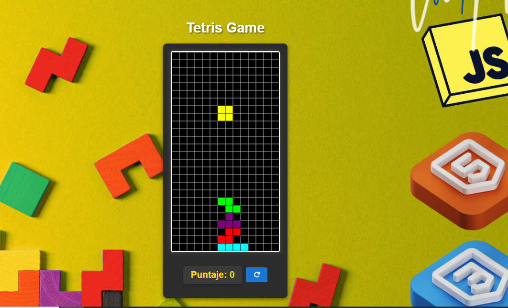
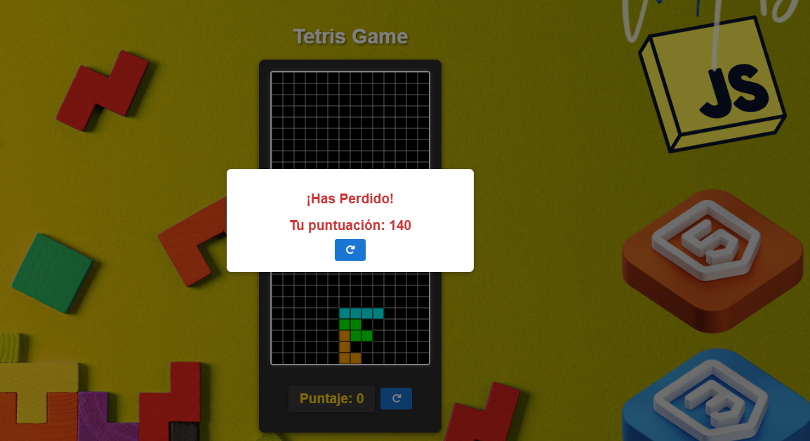

# 🎮 Juego de Tetris

¡Un clásico juego de Tetris desarrollado con Vite! 🚀 Disfruta de un diseño responsivo, piezas coloridas, sistema de puntuación y un modal de fin de juego. Incluye una imagen de fondo personalizada y un título centrado para una experiencia inmersiva. 🖼️

## ✨ Características

- 🧩 Juego clásico de Tetris con las 7 piezas (tetriminos): O, T, S, Z, L, J, I.
- 📱 Diseño responsivo con un título centrado y una imagen de fondo (`fondoTetris.png`).
- ⭐ Sistema de puntuación en un contenedor estilizado.
- 🚪 Modal de fin de juego con botón de reinicio.
- 🎨 Animaciones suaves y sombras para un aspecto moderno.
- 📲 Adaptado para móviles con estilos optimizados para pantallas pequeñas.

## 🛠️ Tecnologías Usadas

- ⚡ **Vite**: Herramienta de construcción rápida y servidor de desarrollo.
- 📜 **JavaScript**: Lógica del juego (movimiento, colisiones, puntuación).
- 🎨 **HTML5 Canvas**: Renderizado del tablero y piezas.
- 💅 **CSS**: Estilos para el contenedor, título, modal y diseño responsivo.
- 🌐 **Git**: Control de versiones para el proyecto.

## 📸 Capturas de Pantalla


_🎮 Pantalla principal con el tablero, puntuación e imagen de fondo._


_🚪 Modal de fin de juego con botón de reinicio._

> **Nota**: Agrega las capturas a la carpeta `screenshots/` y actualiza las rutas si cambias los nombres.

## 🔧 Instalación

Sigue estos pasos para configurar el proyecto localmente:

1. **📥 Clonar el repositorio**:

   ```bash
   git clone https://github.com/tu-usuario/tetris-vite.git
   cd tetris-vite
   ```

2. **📦 Instalar dependencias**:
   Asegúrate de tener [Node.js](https://nodejs.org/) (versión 16 o superior) instalado. Luego:

   ```bash
   npm install
   ```

3. **🖼️ Verificar activos**:
   Confirma que `fondoTetris.png` esté en `public/` o `src/`, como se referencia en `src/styles/style.css`.

## 🚀 Ejecutar el Proyecto

1. **🌐 Iniciar el servidor de desarrollo**:

   ```bash
   npm run dev
   ```

   Abre `http://localhost:5173` en tu navegador para jugar.

2. **📦 Construir para producción** (opcional):

   ```bash
   npm run build
   ```

   Genera archivos estáticos en `dist/`.

3. **👀 Previsualizar el build** (opcional):
   ```bash
   npm run preview
   ```
   Abre `http://localhost:4173` para probar el build.

## 🎲 Instrucciones de Juego

- **🕹️ Controles**:
  - ⬅️ **Flecha Izquierda**: Mover pieza a la izquierda.
  - ➡️ **Flecha Derecha**: Mover pieza a la derecha.
  - ⬇️ **Flecha Abajo**: Bajar pieza más rápido.
  - ⬆️ **Flecha Arriba**: Rotar pieza.
  - ❇️ **Espacio**: Dejar caer la pieza instantáneamente.
- **🎯 Objetivo**: Acomoda las piezas para completar líneas horizontales, sumando puntos.
- **🏁 Fin del Juego**: Si las piezas llegan arriba, aparece un modal con botón de reinicio.

## 🤝 Contribuir

¡Tus ideas son bienvenidas! 🌟 Para contribuir:

1. 🍴 Haz un fork del repositorio.
2. 🌱 Crea una nueva rama (`git checkout -b rama-caracteristica`).
3. ✍️ Realiza tus cambios y haz commit (`git commit -m "Añadir característica"`).
4. 🚀 Sube tu rama (`git push origin rama-caracteristica`).
5. 📬 Abre un Pull Request en GitHub.

Asegúrate de seguir el estilo del código e incluir pruebas si es necesario.

## 📜 Licencia

Este proyecto está licenciado bajo la **Licencia MIT**. Consulta el archivo [LICENSE](LICENSE) para más detalles.
